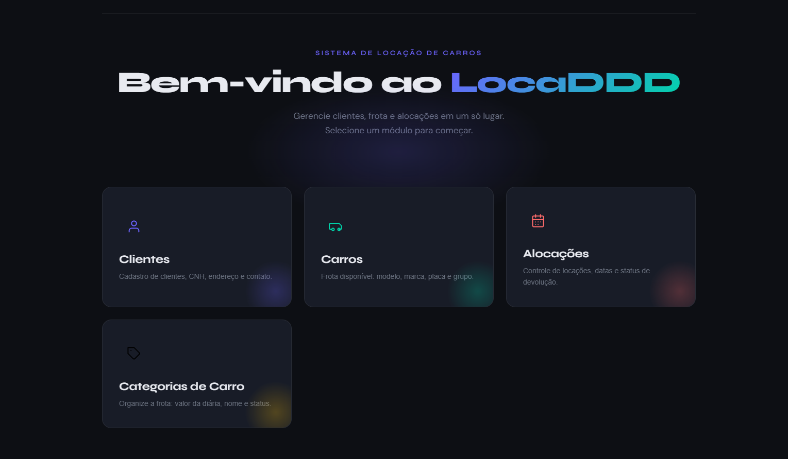

# 🚗 LocaDDD - Frontend

[](https://locadora-ddd-front-react.vercel.app/)
[](https://reactjs.org/)
[](https://vitejs.dev/)

**Frontend do sistema de locação de veículos LocaDDD** – uma aplicação moderna para gestão de clientes, carros, categorias e alocações, construída com React e seguindo conceitos de **Domain-Driven Design (DDD)** no consumo da API.

> 🔗 **Repositório do Backend (ASP.NET Core):** [andre-monar/locadora-ddd-back-dotnet](https://github.com/andre-monar/locadora-ddd-back-dotnet)

  

---

## ✨ Funcionalidades

- **CRUD completo** de Clientes, Carros, Categorias e Alocações
- **Máscaras de entrada** (CPF, Celular, CEP)
- **Validações reativas** com mensagens de erro da API
- **Modal de formulário** responsivo com suporte a selects, textarea, número, data e arquivo (imagem)
- **Tabela dinâmica** com skeletons, ações extras e confirmação de exclusão
- **Toast de notificação** (sucesso/erro)
- **Design escuro** com CSS custom properties e animações suaves
- **Navegação SPA** com React Router
- **Conexão com API REST** hospedada na Azure (CI/CD configurado)

---

## 🛠️ Tecnologias

- **React 18** (com `createRoot`)
- **React Router DOM** – rotas declarativas
- **Vite** – build tool e dev server ultrarrápido
- **Fetch API nativa** – serviço de requisições
- **CSS3** – variáveis CSS, flexbox, grid, keyframes
- **Fontes:** Syne (títulos) + DM Sans (corpo)
- **Vercel** – deploy e hospedagem com CI/CD integrado

---

## ❓ Como executar localmente

### Pré‑requisitos
- Node.js (versão 18 ou superior)
- npm ou yarn
- Backend em execução (ou use a URL da API já implantada)

### Passos

1. **Clone o repositório**
   ```bash
   git clone https://github.com/andre-monar/locadora-ddd-front-react.git
   cd locadora-ddd-front-react
   ```
2. **Instale as dependências**
   ```bash
   npm install
   # ou
   yarn
   ```
3. **Configure a variável de ambiente**
   Crie um arquivo `.env` na raíz do projeto:
   ```bash
   VITE_API_URL=https://sua-api.azurewebsites.net/api
   # Use a URL da API rodando localmente ou na nuvem (confira o repo do backend)
   ```
4. **Inicie o servidor de desenvolvimento
   ```bash
   npm run dev
   # ou
   yarn dev
   ```
5. **Acesse no navegador**
   Abra http://localhost:5173
   
## 🌍 Deploy
O frontend está publicado na Vercel através da integração com o GitHub.
Cada push na branch `main` gera uma nova implantação automaticamente.

🔗 Aplicação em produção: https://locadora-ddd-front-react.vercel.app/

## 🔌 Integração com a API

O frontend consome uma API RESTful desenvolvida em **ASP.NET Core** (repositório backend).

### Endpoints esperados

| Método | Endpoint | Descrição |
|--------|----------|-----------|
| GET | `/api/Cliente` | Lista todos os clientes |
| POST | `/api/Cliente` | Cria um cliente |
| PUT | `/api/Cliente/{id}` | Atualiza cliente |
| DELETE | `/api/Cliente/{id}` | Remove cliente |
| GET | `/api/Carro` | Lista todos os carros |
| POST | `/api/Carro` | Cria um carro |
| PUT | `/api/Carro/{id}` | Atualiza carro |
| DELETE | `/api/Carro/{id}` | Remove carro |
| GET | `/api/Alocacao` | Lista todas as alocações |
| POST | `/api/Alocacao` | Cria uma alocação |
| PUT | `/api/Alocacao/{id}` | Atualiza alocação |
| DELETE | `/api/Alocacao/{id}` | Remove alocação |
| GET | `/api/CategoriaCarro` | Lista todas as categorias |
| POST | `/api/CategoriaCarro` | Cria uma categoria |
| PUT | `/api/CategoriaCarro/{id}` | Atualiza categoria |
| DELETE | `/api/CategoriaCarro/{id}` | Remove categoria |

### Códigos de resposta

| Código | Significado | Formato |
|--------|-------------|---------|
| `200` | Sucesso | Corpo JSON com dados |
| `204` | Sucesso sem conteúdo | Corpo vazio (usado em DELETE) |
| `400` | Erro de validação | `{ erros: [{ campo, mensagem }] }` |

### Tratamento de erros

A camada `services/api.js` já implementa:
- ✅ Tratamento automático de erros de validação
- ✅ Exibição das mensagens nos campos do formulário via `FormModal`
- ✅ Toast de notificação para erros genéricos

